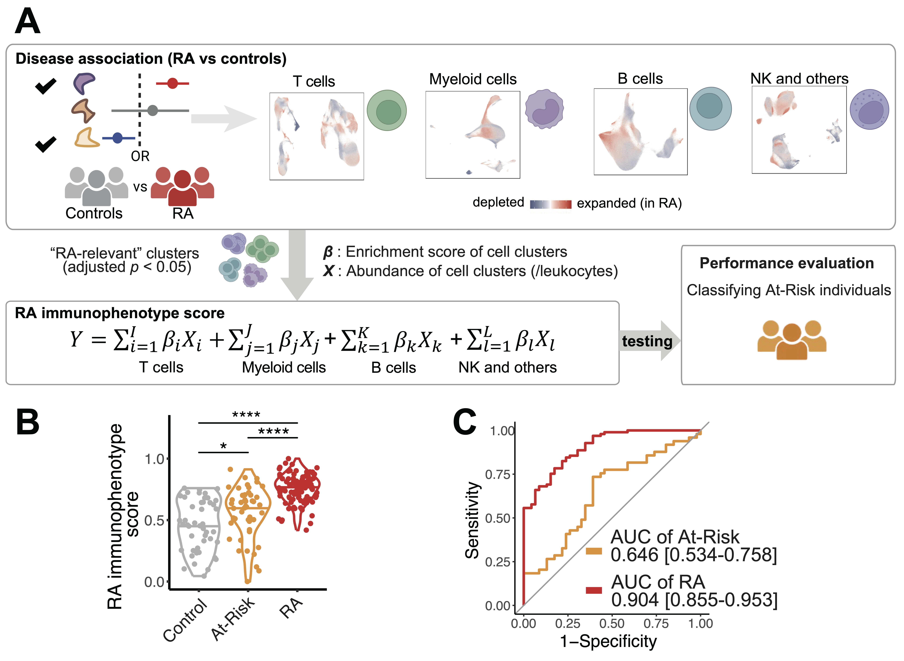

# Deep immunophenotyping reveals circulating activated lymphocytes in individuals at risk for rheumatoid arthritis

Rheumatoid arthritis (RA) is a systemic autoimmune disease with currently no universally highly effective prevention strategies. Identifying pathogenic immune phenotypes in ‘At-Risk’ populations prior to clinical disease onset is crucial to establishing effective prevention strategies. Here, we applied mass cytometry to deeply characterize the immunophenotypes in blood from At-Risk individuals identified through the presence of serum antibodies to citrullinated protein antigens (ACPA) and/or first-degree relative (FDR) status (n=52), as compared to established RA (n=67), and healthy controls (n=48). We identified significant cell expansions in At-Risk individuals compared with controls, including CCR2+CD4+ T cells, T peripheral helper (Tph) cells, type 1 T helper cells, and CXCR5+CD8+ T cells. We also found that CD15+ classical monocytes were specifically expanded in ACPA-negative FDRs, and an activated PAX5low naïve B cell population was expanded in ACPA-positive FDRs. Further, we developed an “RA immunophenotype score” classification method based on the degree of enrichment of cell states relevant to established RA patients. This score significantly distinguished At-Risk individuals from controls. In all, we systematically identified activated lymphocyte phenotypes in At-Risk individuals, along with immunophenotypic differences among both ACPA+ and ACPA- FDR At-Risk subpopulations. Our classification model provides a promising approach for understanding RA pathogenesis with the goal to further improve prevention strategies and identify novel therapeutic targets. 

**Reference: Inamo J et al. Deep immunophenotyping reveals circulating activated lymphocytes in individuals at risk for rheumatoid arthritis. ([preprint](https://XXX))**

# Overview of mass cytometry analytical strategy, clustering, and classifications in our study.

We deeply characterized the immunophenotypes in blood of At-Risk individuals, established RA, and relevant controls enrolled from the SERA (Studies of the Etiologies of Rheumatoid Arthritis) and the AMP RA/SLE (Accelerating Medicines Partnership Rheumatoid Arthritis/Systemic Lupus Erythematosus).

# Highlights
- We identified multiple immune cell populations relevant to the preclinical phase of RA
- We developed an "RA immunophenotype score" schema to quantify the degree of enrichment of RA-relevant immune cell populations for individuals

# Results summary

**Identifications of specific T cell populations that were associated with At-Risk. A.** Cells in UMAP are colored in red (expansion) or blue (depletion) and p-value is shown as well. **B.** Distributions of cell neighborhood correlations and odds ratio. Error bars represent 95% confidence intervals. 

**Classifications for At-Risk individuals and established RA individuals. A**. RA immunophenotype score utilizing RA-specific cell type abundances to quantify and distinguish At-Risk individuals from control. For each cell type, all p-values from the covarying neighborhood analysis test were p = 1e-3. We incorporated clusters that are significantly associated with RA (adjusted p < 0.05) to model the RA immunophenotype score. We calculated RA immunophenotype score based on cell type abundances multiplied by corresponding major cell type proportions and enrichment scores for each cell type, **B.** Distribution of RA immunophenotype score across individual samples from RA, At-Risk, and controls; **** p < 0.0001, * p < 0.05, **C.** Receiver operating characteristic (ROC) analysis to evaluate the classification performance of RA immunophenotype score in distinguishing At-Risk from control. Areas under the curve (AUC) with 95% confidence intervals were described. All the analyses are adjusted for age and sex.

# Contact us
Please contact us (Jun Inamo: JUN.INAMO@CUANSCHUTZ.EDU) with any questions or comments.

The data presented here comes from the laboratory of [Dr. Fan Zhang](https://fanzhanglab.org/) through collaborating with AMP [RA/SLE](https://www.niams.nih.gov/grants-funding/funded-research/accelerating-medicines/RA-SLE).